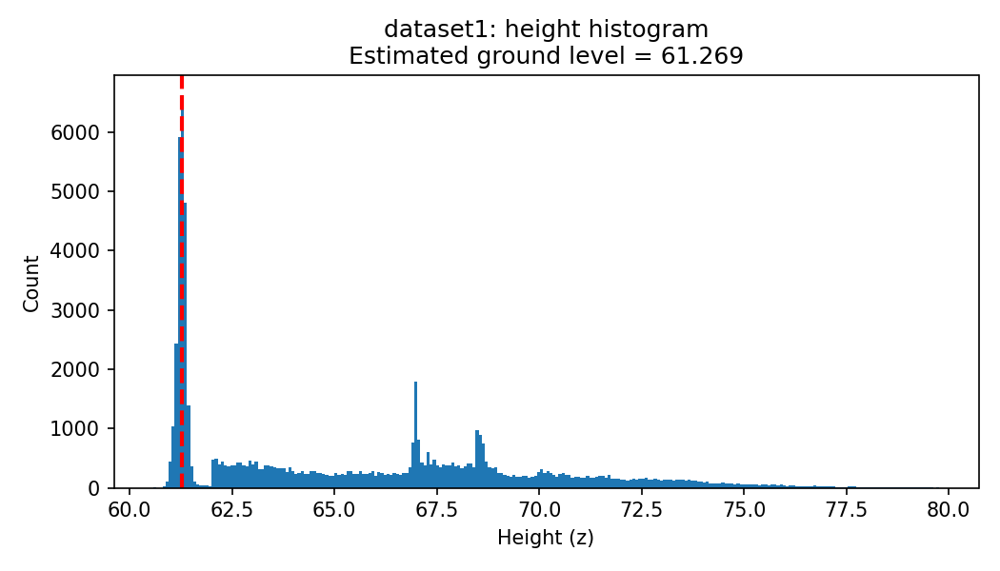

# Lidar_processing
Assignment 5

## Task 1 — Ground Level Estimation

### Goal

The goal of Task 1 is to find the ground level in two LiDAR datasets.
Each dataset is a point cloud where every row is an x, y, z point.
I only use the z values (height) to estimate where the ground is.

### Method

I made a function called get_ground_level(). This is what I do inside it:

- I take all z values from the point cloud.
- I remove extreme outliers (too high or too low values).
- I create a histogram of the z values using np.histogram.
- I look for the strongest peak in the lower part of the histogram.

That peak is the ground level. This works because the ground is usually the most common low surface in the data, so it makes a strong peak.

### Results

- dataset1 ground level: **61.269**
- dataset2 ground level: **61.255**

The values are almost the same (around 61.2). This shows that both datasets have the ground at the same height. Other peaks in the histogram must come from objects above ground like rails, pylons, or trees. 

### Histograms
Each figure shows the histogram of z values. The red dashed line shows the estimated ground level.

Figure 1: Dataset 1

Figure 2: Dataset 2  
 

